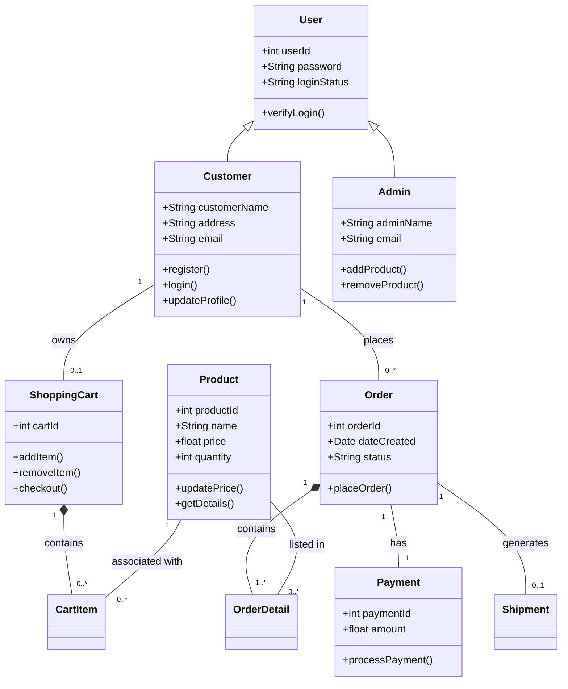

I have structured this into three parts: Assumptions, Class Identification, and the Diagram itself.

# 1. Assumptions of the System

Before designing the classes, we must establish the scope and rules of the system.

**Registration Required**: A user must register and log in to place an order (Guest checkout is not modeled here for simplicity).

**Single Seller**: The system represents one vendor selling to many customers (not a multi-vendor marketplace like Amazon).

**Payment Gateway**: Payment processing is handled by an external system; our system only records the Payment Status.

**Inventory Management**: The Admin is responsible for adding/modifying products. The system checks stock availability before confirming an order.

**One Cart**: A customer has one active shopping cart at a time.

# 2. Identification of Classes

Based on the assumptions, here are the core classes, their responsibilities, and attributes.

<Table goes here>

# 3. Class Diagram for Online Shopping System

Below is the visual representation of the Class Diagram.
Diagram Logic & Relationships (Mermaid)
**Inheritance**: Customer and Admin inherit from User.
**Composition**: An Order consists of OrderDetails (if the order dies, the details die).
**Association**: A Customer has a ShoppingCart and places Orders.
<!-- end list -->

**Explanation of Relationships**

**User (Generalization)**: Both Customer and Admin are types of User. They share common attributes like login credentials.
**Customer → Order (Association)**: A Customer can place multiple Orders (1 to Many).
**ShoppingCart → CartItem (Composition)** : A Cart is made up of Cart Items. If the Cart is deleted, the items inside it cease to exist in that context.
**Product → OrderDetail (Association)**: A Product (e.g., "Laptop") can appear in many different Orders.
