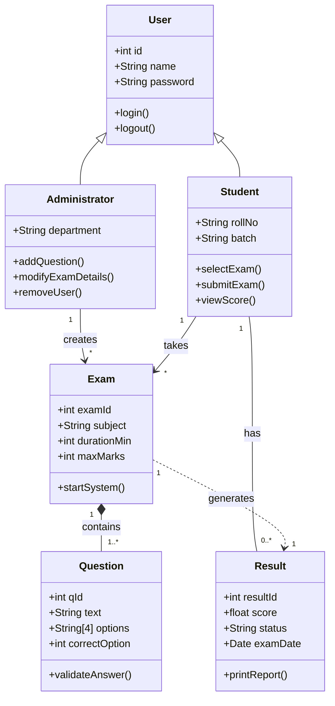

# Draw Class Diagram for Online Examination System.

I will break this down into Assumptions, Class Identification, and the Diagram itself.

**1. Assumptions of the System**

**Role Separation**: There are two distinct users: Students (who take the test) and Administrators (who manage questions/users).

**MCQ Format**: The examination consists of Multiple Choice Questions (MCQs) to allow for automatic system grading.

**Timed Assessment**: Each exam has a fixed duration and total marks.

**One-Attempt Constraint**: For this model, we assume a student takes a specific exam only once.

**Automatic Results**: The system calculates the score immediately upon submission.

**2. Identification of Classes**

**3. Class Diagram for Online Examination System**

​Diagram Logic & Relationships (Mermaid)
​Inheritance: Student and Administrator inherit from the User class.
​Composition: An Exam is composed of Questions. If the Exam is deleted, the specific arrangement of questions for that session is removed.
​Association:
​An Administrator creates/manages the Exam.
​A Student takes an Exam.
​A Student gets a Result.
​<!-- end list -->

**Explanation of Cardinality (Multiplicity)**

* Exam 1 -- 1.. Question: One Exam must contain at least one Question, but usually contains many.

* Student 1 -- 0.. Result:** A Student might not have taken any exams yet (0 results), or they may have taken many (many results).

* Administrator 1 --> * Exam: One Administrator can create multiple exams.

